# DH2323-WaveBuoyancy

**Real-Time Surface-Pressure Buoyancy with Adaptive Curved Clipping**
A Unity + C++ implementation of Hirae et al. (2025)'s closed-form hydrostatic-pressure integrator, with a custom *Adaptive Curved Clipping* refinement for coarse meshes on Gerstner waves.

> Final project for **KTH DH2323 Computer Graphics and Interaction**, by Felix Stenberg.

https://github.com/user-attachments/assets/0cdf0944-02fa-4a78-9991-8b227398369c

---

## Highlights

- **Closed-form per-triangle buoyancy**,exact force and torque, no quadrature error, even on coarse meshes (Hirae et al. 2025, Eqs. 5–9).
- **Wave-agnostic C++ DLL** geometry-only; the wave model lives in C# so the plugin is reusable across wave systems.
- **Adaptive Curved Clipping** refines per-vertex water heights along the clipping chord without geometric surface intersection. This was the project's main research contribution.
- **Burst-compiled wave sampler** `IJobParallelFor` + `Unity.Mathematics`, ~6–10× speedup over plain C#.
- **Garland–Heckbert runtime mesh simplification** for buoyancy meshes (`UnityMeshSimplifier`).
- **Bug found in the source paper.** A typographical error in Hirae et al.'s printed torque equations (Eqs. 7–9) was identified, re-derived from scratch, and corrected. The derivation notes and report draft live locally under the intentionally ignored `resources/` folder. Authors have been contacted.

---

## Gallery

### Multiple objects on waves
<video src="https://github.com/Crispigt/DH2323-WaveBuoyancy/raw/main/report-assets/NewVideosAndPicture/MultipleObjectsWave.mp4" controls muted loop width="720"></video>

> Cubes (linear clipping), bunny (adaptive N=4), dragon (linear), all driven by the same DLL integrator. Fallback: [`MultipleObjectsWave.mp4`](report-assets/NewVideosAndPicture/MultipleObjectsWave.mp4).

### Bunny + dragon side-by-side
<video src="https://github.com/Crispigt/DH2323-WaveBuoyancy/raw/main/report-assets/VideosAndPicturesFromBlog/BunnyDragon.mp4" controls muted loop width="720"></video>

> Mixed mesh complexity floating concurrently. Fallback: [`BunnyDragon.mp4`](report-assets/VideosAndPicturesFromBlog/BunnyDragon.mp4).

### Cube bobbing, damping in action
<video src="https://github.com/Crispigt/DH2323-WaveBuoyancy/raw/main/report-assets/VideosAndPicturesFromBlog/cubebobbing.mp4" controls muted loop width="640"></video>

> Cube on calm Gerstner waves; angular momentum damping in steady state. Fallback: [`cubebobbing.mp4`](report-assets/VideosAndPicturesFromBlog/cubebobbing.mp4).

### Angular damping coefficient sweep
<video src="https://github.com/Crispigt/DH2323-WaveBuoyancy/raw/main/report-assets/NewVideosAndPicture/DampningDifferent.mp4" controls muted loop width="720"></video>

> Sweep over α: α=1 leaves angular momentum unchanged, while smaller values damp more aggressively. Fallback: [`DampningDifferent.mp4`](report-assets/NewVideosAndPicture/DampningDifferent.mp4).

### Bug demos (the project's two most instructive failures)

| Sub-triangle winding-order bug | Paper Eq. 7–9 typo (settles at 45° instead of 26.565°) |
|---|---|
| <video src="https://github.com/Crispigt/DH2323-WaveBuoyancy/raw/main/report-assets/VideosAndPicturesFromBlog/FirstBug-wrongorder.mp4" controls muted loop width="380"></video> | <video src="https://github.com/Crispigt/DH2323-WaveBuoyancy/raw/main/report-assets/VideosAndPicturesFromBlog/PapperEquation.mp4" controls muted loop width="380"></video> |
| Fallback: [`FirstBug-wrongorder.mp4`](report-assets/VideosAndPicturesFromBlog/FirstBug-wrongorder.mp4) | Fallback: [`PapperEquation.mp4`](report-assets/VideosAndPicturesFromBlog/PapperEquation.mp4) |

### Linear vs Adaptive clipping (debug gizmos)
| Linear clipping | Adaptive curved clipping |
|---|---|
| 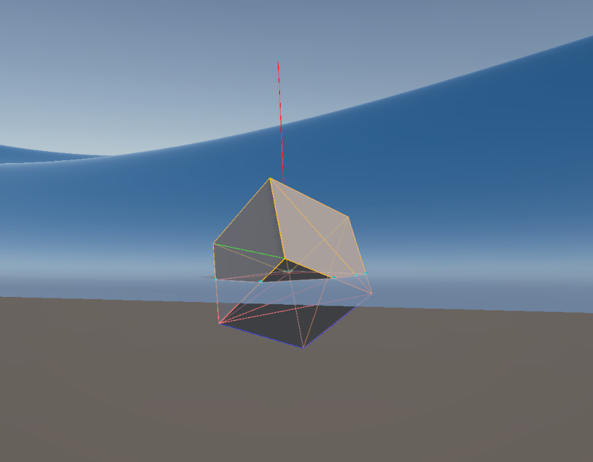 | 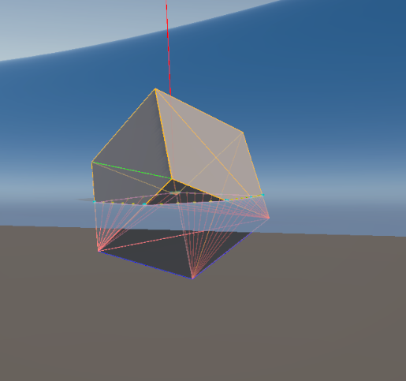 |

### Mesh simplification (Garland–Heckbert)
| 30,000-triangle ground truth | Roughly 7k-triangle buoyancy mesh |
|---|---|
| 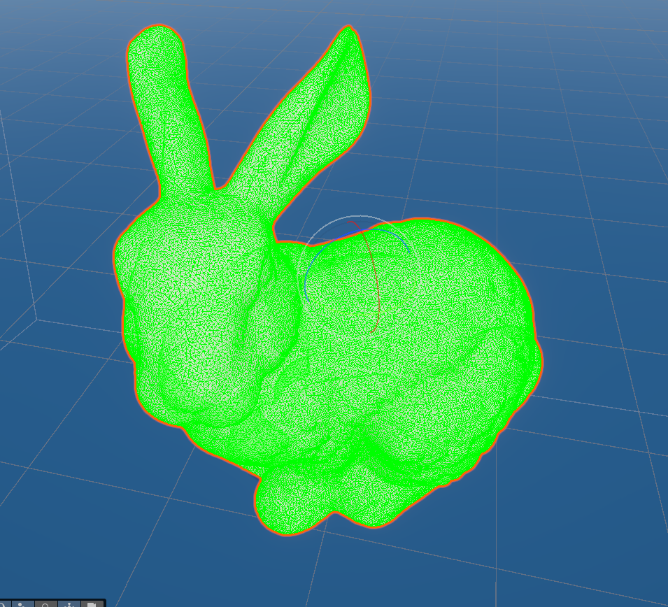 | 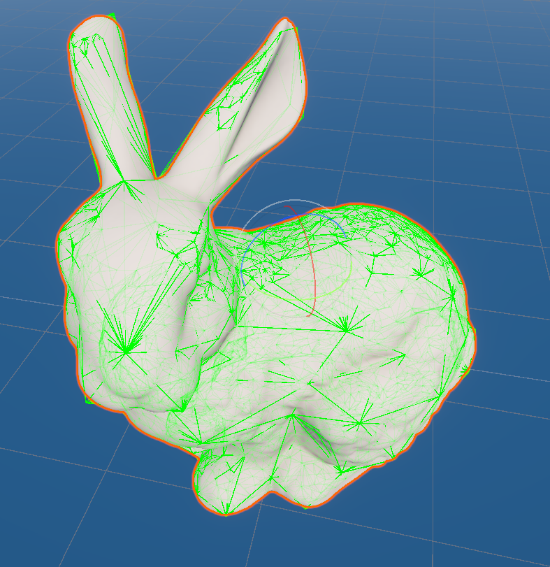 |

### Test environments
| Force Sweep | Adaptive Clipping Comparison |
|---|---|
| 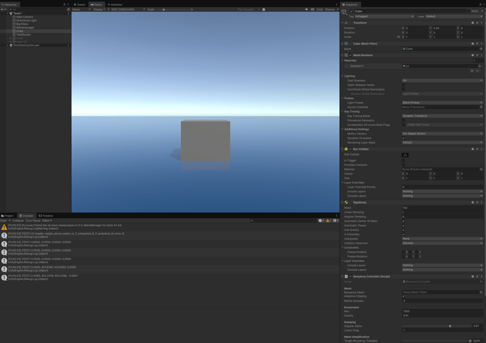 | 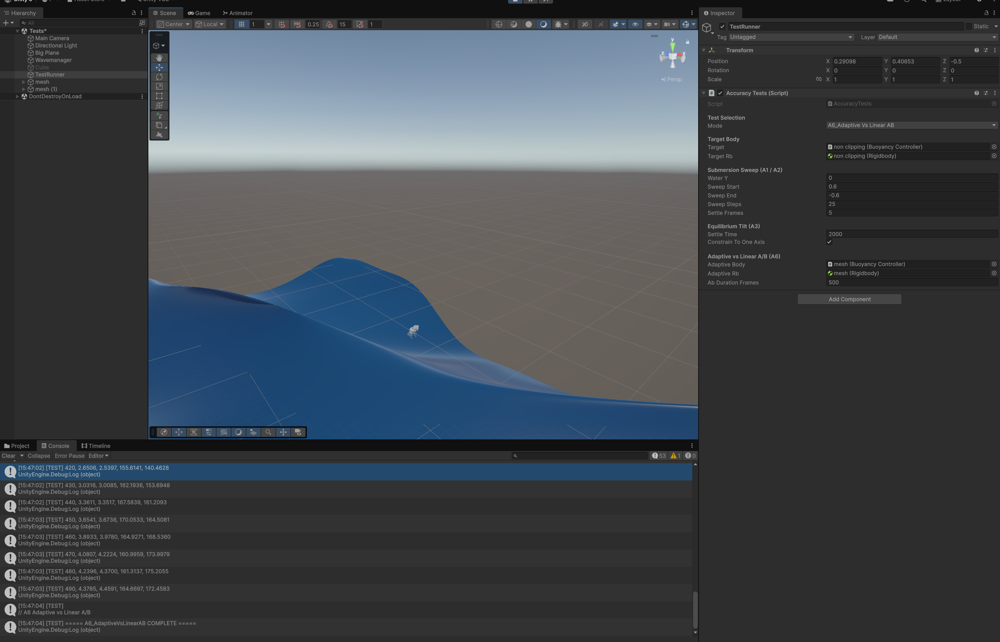 |

| Equilibrium Tilt (Corrected) | Equilibrium Tilt (Paper formula with typo) |
|---|---|
| 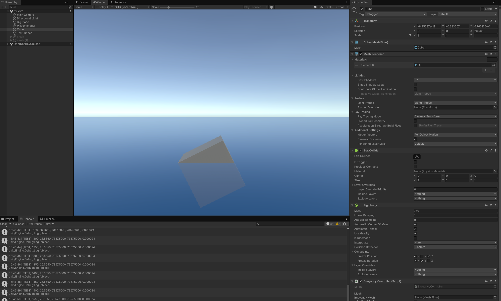 | 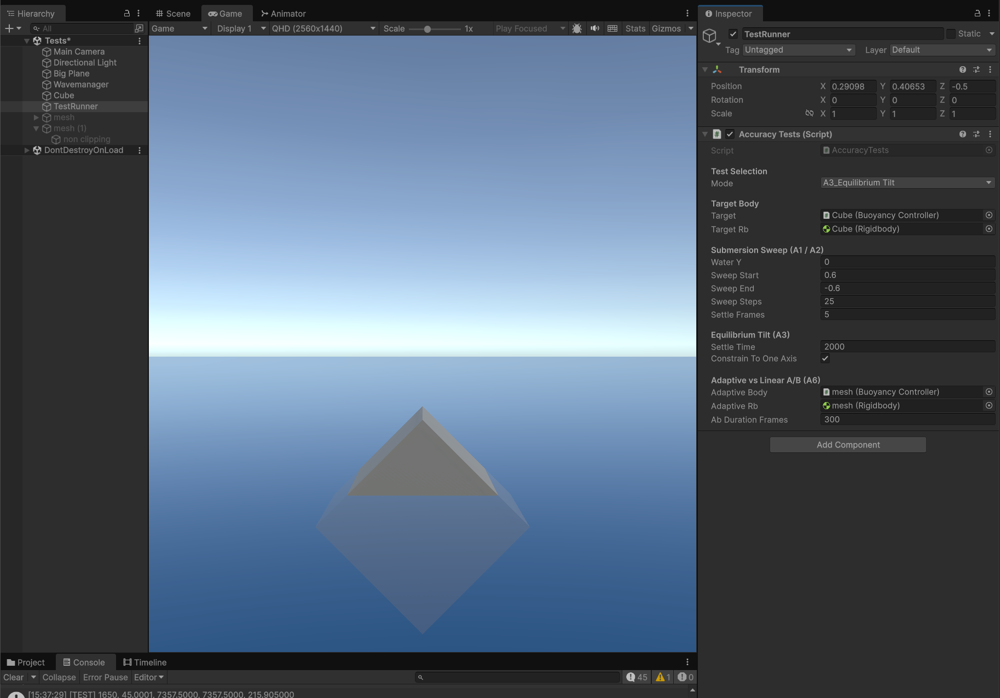 |

### Concept diagrams
| Per-triangle force/torque | Adaptive clipping concept |
|---|---|
| 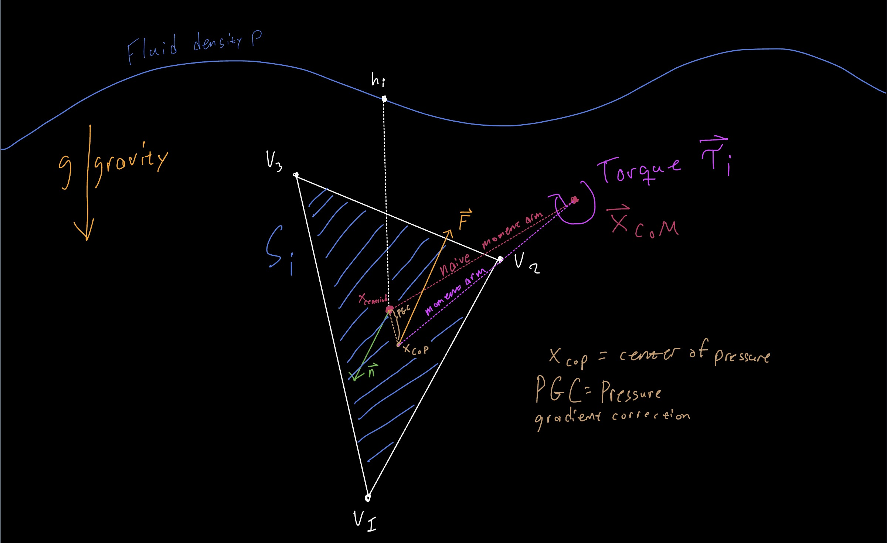 | 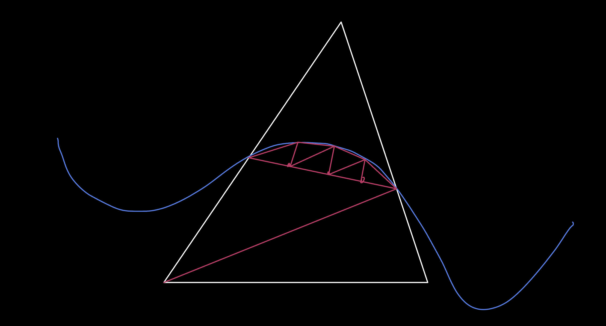 |

### `BuoyancyController` inspector
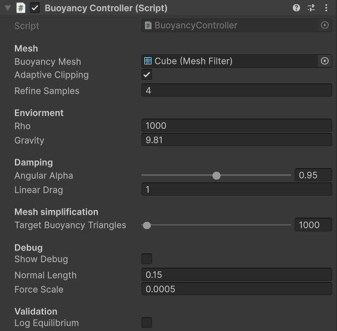

---

## More videos

All public clips live under [`report-assets/`](report-assets/). Click to download/play:

| Clip | What it shows |
|---|---|
| [`BunnyDragonCube.mp4`](report-assets/VideosAndPicturesFromBlog/BunnyDragonCube.mp4) | All three object types together |
| [`FullyFixed.mp4`](report-assets/VideosAndPicturesFromBlog/FullyFixed.mp4) | Final integrator settling correctly after the typo fix |
| [`SomeObjectsFlat.mp4`](report-assets/NewVideosAndPicture/SomeObjectsFlat.mp4) | Mixed objects on near-flat water (steady-state) |
| [`CatlikeWavesWorking.mp4`](report-assets/VideosAndPicturesFromBlog/CatlikeWavesWorking.mp4) | URP Gerstner wave shader running standalone |
| [`opaque.mp4`](report-assets/VideosAndPicturesFromBlog/opaque.mp4) | Opaque variant of the water shader |

---

## Results at a glance

| Metric | Value |
|---|---|
| Cube force-sweep error vs analytical $F_b = \rho g V$ | < 10⁻⁶ % (FP noise) |
| Equilibrium tilt (corrected formula) vs Igarashi & Nakamura analytical 26.565° | **26.565°**, residual torque 2.4×10⁻⁵ N·m |
| Equilibrium tilt (paper formula, with typo) | 45.000°, residual torque 215.9 N·m |
| Linear path tilt error (~7k tris) vs 30k ground truth (rough waves) | ~6° (mesh/dynamics dominated) |
| Adaptive N=4 tilt error vs 30k ground truth | ~5.5° (Adaptive vs Linear gap < 0.5°) |
| Adaptive N=4 vs N=16 difference | 0° (fully converged at N=4) |
| 100-sphere stress test, Linear C++ DLL | **363 FPS** average |
| 100-sphere stress test, Adaptive N=1 (managed C#) | 53 FPS avg, degrades to 3 FPS at equilibrium |

Plots live in [`report-assets/plots/`](report-assets/plots/) and are regenerated with `python resources/plot_tests.py` and `python resources/plot_performance.py`.

| Accuracy validation | Convergence study | Stress test |
|---|---|---|
| 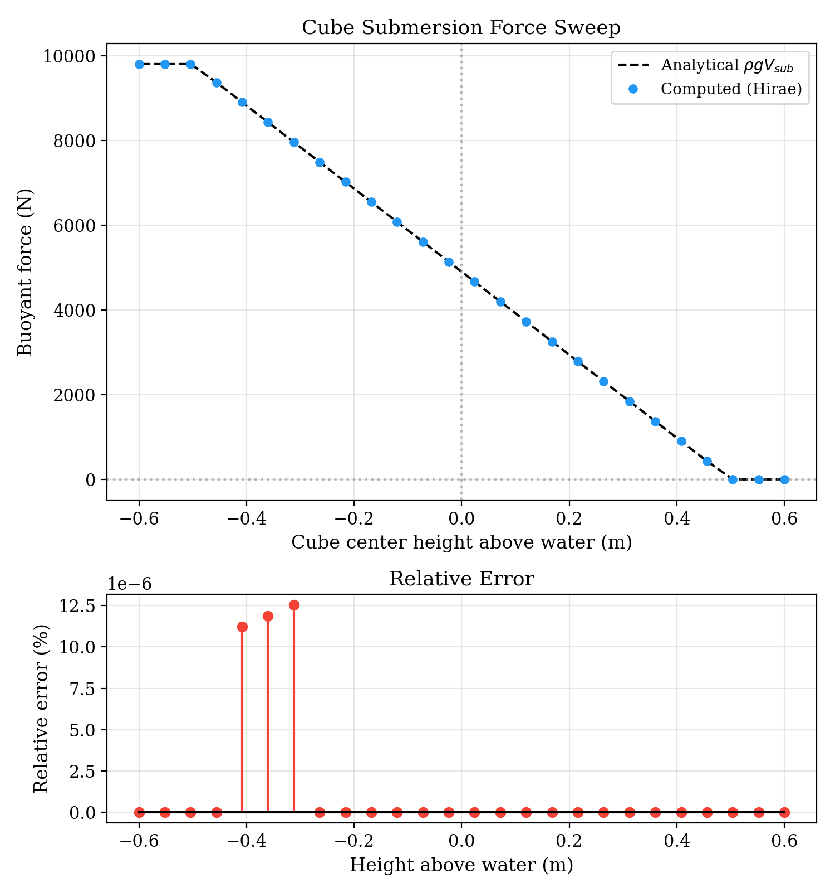 | 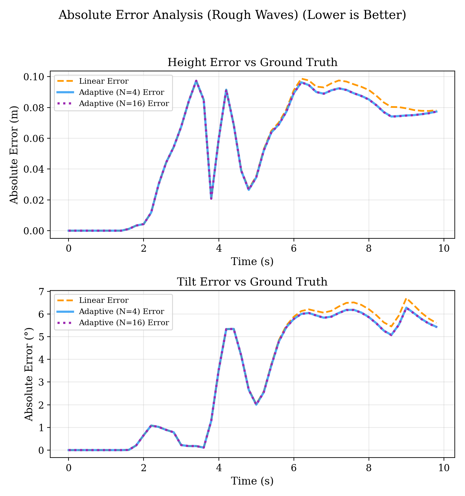 | 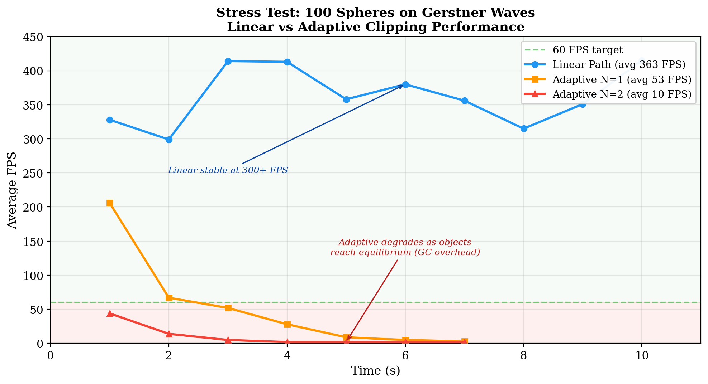 |

| Equilibrium tilt, corrected formula vs paper formula |
|---|
| 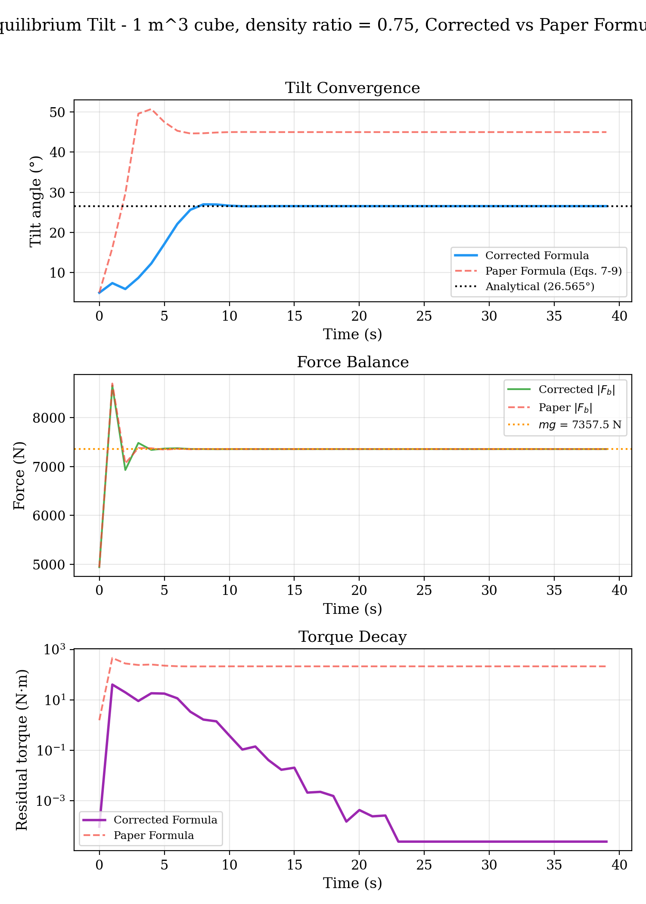 |

---


## Building

### Native plugin (C++ DLL)

The plugin uses GLM as a git submodule. Initialize submodules first:

```sh
git submodule update --init --recursive
```

Then configure and build with CMake (Windows / Visual Studio shown; any CMake-supported toolchain works):

```sh
cd NativePlugin
cmake -S . -B build
cmake --build build --config Release
```

The resulting DLL is consumed by Unity via `[DllImport]` in the buoyancy controllers.

### Unity project

Open [`BaseProject/`](BaseProject/) in **Unity 6.x** (URP). Press Play. Test scenes contain prefabs for the cube/bunny/dragon/sphere stress scenarios used in the report.


## Documentation

Blog can be found at: https://crispigt.com/dh2323

---

## References

- **Hirae, H., Morishima, S., & Ando, R.** (2025). *An Analytical Integrator for Solid-Fluid Coupled Buoyancy Forces.* SIGGRAPH Asia 2025 Technical Communications.
- **Hori, T.** (2021). *Proof that the Center of Buoyancy is Equal to the Center of Pressure by means of the Surface Integral of Hydrostatic Pressure Acting on the Inclined Ship.* Nagasaki Institute of Applied Science.
- **Fábián, G.** (2025). *Approximate and exact buoyancy calculation for real-time floating simulation of meshes.* Eurographics 2025 Short Paper.
- **Flick, J.** (2024). *Waves, Catlike Coding.* https://catlikecoding.com/unity/tutorials/flow/waves/ (MIT)
- **Garland, M. & Heckbert, P.** (1997). *Surface simplification using quadric error metrics.* SIGGRAPH '97.
- **Igarashi, T. & Nakamura, R.** (2007). *The equilibrium angles of floating cubes.*
- **Hwang, W. & Salvendy, G.** (2010). *Number of people required for usability evaluation: the `10 ± 2` rule.* CACM 53(5), 130–133.

---

## Acknowledgments

Christopher Peters and the DH2323 course team at KTH. Jasper Flick (Catlike Coding) for the MIT-licensed Gerstner wave implementation. Hirae et al. for the integrator that this work builds on.

## License

Code in this repository is released under the MIT License unless noted otherwise. Third-party assets (Catlike Coding wave shader, GLM, UnityMeshSimplifier, Stanford bunny/dragon meshes) retain their respective licenses.
